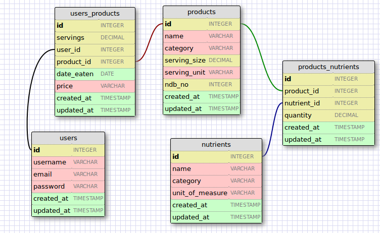

# Nutrition Tracker

A simple web app for keeping track of your daily diet.

I used the <a href='https://ndb.nal.usda.gov/ndb/api/doc' target="_blank">USDA National Nutritional Database (NDB) API</a> to gather information on both processed and prepared foods.

### A user can:

* Look up a food by name, using the USDA's NDB API
* Record having eaten a food, how much of it was eaten, and on what day
* Review what foods were eaten each day
* Sort the daily food record by servings, nutrients, and food category

In order to limit how many requests are made while using the app, new foods are stored in a Rails database. Each nutrient also has its own reusable record in order to reduce storage size and simplify filtering. The NDB is an extensive database with a plethora of nutritional information, and it proved the easiest to use.

The JSON API from <a href="http://openfoodfacts.org" target="_blank">openfoodfacts.org</a> was initially appealing, but failed to cover as wide a range of products as needed. The API only allows a query by UPC, reducing its usefulness.

<a href="http://www.product-open-data.com/navigate/">Product Open Data</a> (POD) provided a more comprehensive listing of food products, but did not yet have an available API. Using POD would have required downloading a 200+ MB database, and I decided against that.

## Try it out!

The latest stable version of the <a href="https://quiet-falls-55777.herokuapp.com" target="_blank">Nutrition Tracker</a> is deployed on Heroku. Try it <a href="https://quiet-falls-55777.herokuapp.com" target="_blank">here!</a>

## Technologies

This application uses Ruby on Rails 4 as the backend, ReactJS, jQuery, HTML5, and CSS 3 for the front end, and AJAX to handle server requests.

The Rails database stores product and nutrient records to reduce the number of requests made to the USDA's NDB

As of 06 April 2015, the app uses ReactJS to render a single-page, responsive, performant user experience. The products list now updates as the user types in the search box; rather than making a request to the server, the app uses React to filter the list client-side.

## Features

Unchecked boxes are not yet implemented

:white_check_mark: Find food from NDB by name

:white_check_mark: Find food in Rails database by name

:white_check_mark: Register a new user (create new user record)

:white_check_mark: A user can create new record of a food eaten: when, how much, and what it cost

:white_check_mark: A user can edit any food eaten record they created

:white_check_mark: A user can delete any food eaten record they created

:white_check_mark: Filter records of food eaten

## Schemas

Original schema for the Minimum Viable Product (MVP), including a table to store product names for easier searchability.
